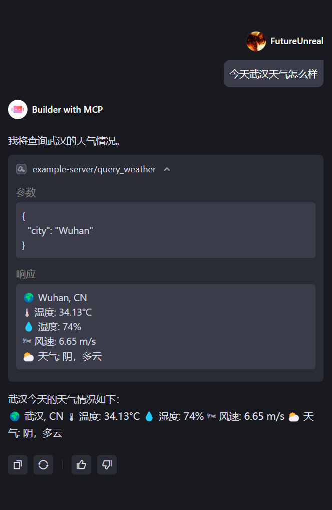

# 第6章 动手写一个MCP

## 6.1 uv 的使用

### 6.1.1 验证安装

在开始使用 uv 之前，需要确认 uv 是否已经成功安装。可以通过在终端或命令提示符中运行以下命令来验证：

```bash
uv --version
```

如果 uv 已经成功安装，上述命令会输出 uv 的版本号，如下图所示。


### 6.1.2 环境配置

**1. 项目初始化**

在配置环境之前，先来简单了解一下项目根目录中的 `pyproject.toml` 文件。它是项目的核心配置文件，主要通过以下几个部分来定义项目：

-   **`[project]`**: 包含项目的基本信息，如名称 (`mcp-lite-dev`)、版本和描述。
-   **`dependencies`**: 列出了项目运行所需的所有第三方库，例如 `mcp`, `openai` 和 `httpx` 等。

由于本项目已经包含了一个预先配置好的 `pyproject.toml` 文件，**不需要**再执行 `uv init` 命令。在你自己从零开始创建新项目时，通常会使用 `uv init` 初始化项目来自动生成此文件。

**2. 创建虚拟环境**

项目初始化后，下一步是创建一个独立的虚拟环境来隔离项目依赖。执行以下命令：

```bash
uv venv
```

uv 会在项目根目录下创建一个名为 `.venv` 的文件夹，其中包含了 Python 解释器和项目所需的库。

**3. 激活虚拟环境**

创建虚拟环境后，需要激活它才能使用。在 Windows 系统中，使用以下命令：

```bash
.venv\Scripts\activate
```

激活后，你的命令行提示符会在最前面显示一个前缀。这个前缀通常直接取自项目文件夹的名称。在本项目中由于项目文件夹名为 `mcp-lite-dev`，激活虚拟环境后，你将看到 `(mcp-lite-dev)` 的前缀。

**4. 安装依赖包**

环境激活后，就可以安装 `pyproject.toml` 文件中声明的所有依赖了。执行以下命令：

```bash
uv pip install -e .
```

## 6.2 构建 MCP Server

接下来根据书本代码从零开始构建一个功能完整的天气查询 MCP Server。这个 Server 将能够被任何兼容 MCP 的客户端（如 IDE 插件、桌面应用等）发现并使用。

> [weather.py完整代码](https://github.com/datawhalechina/mcp-lite-dev/blob/master/src/ch06/weather.py)

### 6.2.1 依赖导入与服务初始化

首先，导入所有必要的库，并初始化 MCP 服务实例。

```python
import json
import os
from typing import Any

import httpx
from dotenv import load_dotenv, find_dotenv
from mcp.server.fastmcp import FastMCP

# 加载 .env 文件中的环境变量，方便管理 API Key 等敏感信息
load_dotenv(find_dotenv(), override=True)

# 初始化 MCP 服务器实例
mcp = FastMCP("WeatherServer")
```

- `FastMCP`: 这是 MCP Python SDK 的核心类。通过 `mcp = FastMCP("WeatherServer")` 创建了一个服务实例。`"WeatherServer"` 是我们为这个服务指定的唯一名称，客户端将通过这个名称来识别和连接它。

### 6.2.2 定义主要功能

接下来，定义两个函数：一个用于从 API 获取数据，另一个用于将数据格式化为用户友好的文本。

```python
# API 配置
OPENWEATHER_API_BASE = "https://api.openweathermap.org/data/2.5/weather"
API_KEY = os.getenv("OPENWEATHER_API_KEY")
USER_AGENT = "weather-app/1.0"

async def fetch_weather(city: str) -> dict[str, Any] | None:
    # (函数体，负责调用 API 并处理网络错误) ...

def format_weather(data: dict[str, Any] | str) -> str:
    # (函数体，负责将 JSON 数据格式化为易读文本) ...
```

- `fetch_weather`: 这是一个异步函数，负责构造请求参数、调用 OpenWeather API 并返回结果。它包含了完整的异常处理逻辑，以应对网络请求中可能出现的各种问题。
- `format_weather`: 这是一个同步函数，它接收 `fetch_weather` 返回的 JSON 数据，并将其转换成一段格式规范、易于阅读的文本。

### 6.2.3 注册 MCP 工具

这是最关键的一步：我们将天气查询功能封装成一个 MCP **工具 (Tool)**。根据 MCP 官方文档[^1]，**工具**是“模型可控”的函数，可以被 LLM 调用以执行特定操作。

```python
@mcp.tool()
async def query_weather(city: str) -> str:
    """
    输入指定城市的英文名称，返回今日天气查询结果。
    :param city: 城市名称（需使用英文）
    :return: 格式化后的天气信息
    """
    data = await fetch_weather(city)
    return format_weather(data)
```

- `@mcp.tool()`: 这个装饰器将 `query_weather` 函数注册为一个 MCP 工具。
- 函数签名 (`async def query_weather(city: str) -> str`): `FastMCP` 会自动解析这个签名。`city: str` 告诉 LLM 这个工具需要一个名为 `city` 的字符串参数。
- 文档字符串 (Docstring): 函数的文档字符串 `"""..."""` 会被自动用作这个工具的描述。LLM 会根据这段描述来理解工具的功能（“输入指定城市的英文名称，返回今日天气查询结果”），从而决定在何时调用它。

通过这种方式，无需编写任何复杂的 schema 或配置文件，`FastMCP` 就为我们生成了符合 MCP 规范的工具定义。

### 6.2.4 启动服务器

最后，需要让服务器运行起来，以监听来自客户端的连接。

```python
# src/ch06/weather.py

if __name__ == "__main__":
    # 以标准 I/O 方式运行 MCP 服务器
    mcp.run(transport='stdio')
```

- `mcp.run(transport='stdio')`: 这行代码启动了 MCP 服务器。`transport='stdio'` 指定了传输方式为**标准输入/输出 (Standard I/O)**。这意味着服务器将通过命令行与客户端进行通信，这是 MCP 最基础也是最常用的一种连接方式，非常适合本地开发和与 IDE 插件集成。

### 6.2.5 配置 MCP Server

这里选择 Trae 作为 MCP Client，如果想使用其他 MCP 客户端，可以参考下面步骤自行尝试。

1. **在 Trae 中配置 MCP Server**

    首先打开 Trae，选择右上角设置中的 `MCP` 选项。

    

    接着点击右上角 `+ 添加` 选项卡，选择**手动添加**。

    

2. **修改配置文件**

    复制下面配置替换默认配置，并加路径改为自己实际代码所在路径，当前配置相当于执行命令 `uv --directory E:\code_demo\MCP_demo\example run weather.py`。

    ```json
    {
        "mcpServers": {
            "example-server": {
            "command": "uv",
            "args": [
                "--directory",
                "E:\\code_demo\\MCP_demo\\example", //根据自己代码所在实际路径修改
                "run",
                "weather.py"
            ]
            }
        }
    }
    ```

    修改并确认后，可以得到如图效果，这个✅说明可以正常运行。

    

3. **测试 MCP Server**

    返回对话界面， `@智能体` 后选择 `Builder with MCP`。

    

    接着在对话界面中，输入“今天武汉天气怎么样”，随后可以看到 LLM 调用了 MCP Server，成功执行并返回了结果。

    

## 6.3 构建 MCP Client

刚才成功构建了一个 MCP Server，并使用 Trae 进行了测试。现在，我们将自己构建一个 MCP Client 来与它交互。这个客户端将扮演“智能对话代理”的角色，它接收用户的自然语言输入，调用大语言模型（LLM）进行理解，并在需要时通过 MCP 协议驱动  `WeatherServer` 来完成特定任务（如查询天气）。

> [mcp_client.py完整代码](https://github.com/datawhalechina/mcp-lite-dev/blob/master/src/ch06/mcp_client.py)

### 6.3.1 模型配置

与服务器一样，客户端也需要配置。这里使用[硅基流动](https://cloud.siliconflow.cn/)的大模型服务，并通过环境变量来管理 API 密钥等敏感信息。确保项目根目录下的 `.env` 文件包含以下内容：

```text
BASE_URL=https://api.siliconflow.cn/v1
MODEL=deepseek-ai/DeepSeek-V3
API_KEY=YOUR_API_KEY
```

下面在 `src/ch06/` 目录下创建 `mcp_client.py` 文件。整个客户端的核心逻辑都封装在 `MCPClient` 类中。

### 6.3.2 初始化客户端

首先，定义 `MCPClient` 类的构造函数 `__init__`。它负责加载 `.env` 文件中的配置，并初始化一个 OpenAI 客户端实例。

```python
# ... (依赖包导入)

# 加载 .env 文件
load_dotenv()

class MCPClient:
    def __init__(self):
        """初始化 MCP 客户端"""
        self.exit_stack = AsyncExitStack()
        self.api_key = os.getenv("API_KEY")
        self.base_url = os.getenv("BASE_URL")
        self.model = os.getenv("MODEL")
        # ... (检查 API Key)
        self.client = OpenAI(api_key=self.api_key, base_url=self.base_url)
        self.session: Optional[ClientSession] = None
```

- `AsyncExitStack`: 这是一个异步上下文管理器，用来管理后续创建的 MCP 连接等资源，确保在程序退出时能被正确关闭。
- `OpenAI(...)`: 创建一个与 LLM 通信的客户端实例。

### 6.3.3 连接并启动 MCP Server

`connect_to_server` 方法利用 MCP SDK 提供的 `stdio_client` 将服务器脚本作为一个子进程在后台启动，并通过标准输入/输出（stdio）建立通信。

```python
    async def connect_to_server(self, server_script_path: str):
        """连接到 MCP 服务器并列出可用工具"""
        # ... (配置并启动服务器子进程)
        stdio_transport = await self.exit_stack.enter_async_context(stdio_client(server_params))
        self.stdio, self.write = stdio_transport
        # 创建一个 MCP 客户端会话
        self.session = await self.exit_stack.enter_async_context(ClientSession(self.stdio, self.write))
        await self.session.initialize()

        # (列出服务器提供的所有工具) ...
```

- `StdioServerParameters`: 定义了如何启动服务器。告诉它使用 `python` 命令来执行指定的脚本（例如 `weather.py`）。
- `stdio_client`: 这是 MCP SDK 提供的一个便捷函数。它会根据 `server_params` 在后台启动一个新的子进程运行 `weather.py`，并将其标准输入（stdin）和标准输出（stdout）连接到客户端。这是实现 `transport='stdio'` 通信的关键。
- `ClientSession`: 创建一个客户端会话实例。它封装了所有 MCP 协议的细节，让我们能通过简单的方法（如 `list_tools`, `call_tool`）与服务器交互。

### 6.3.4 处理大模型工具调用 (Function Calling)

`process_query` 是客户端的核心，完整地实现了 “Function Calling” 的逻辑。当用户输入一句话后，它会请求 LLM，LLM 如果认为需要调用工具，客户端就会执行该工具，然后将结果返回给 LLM，最终生成回答。

```python
    async def process_query(self, query: str) -> str:
        """使用 LLM 处理查询，并在需要时调用 MCP 工具"""
        messages = [{"role": "user", "content": query}]
        # (将 MCP 工具列表转换为 OpenAI 格式) ...

        # 第一次请求 LLM，让其判断是否需要调用工具
        response = self.client.chat.completions.create(
            # (请求参数) ...
        )

        # 检查 LLM 的返回，看它是否决定调用工具
        if response.choices[0].finish_reason == "tool_calls":
            # (解析工具调用请求) ...

            # 通过 MCP session 执行工具调用
            result = await self.session.call_tool(tool_name, tool_args)

            # (将工具调用信息和结果加入到对话历史中) ...

            # 第二次请求 LLM，让它基于工具返回的结果生成最终回答
            response = self.client.chat.completions.create(
                # (请求参数) ...
            )
            return response.choices[0].message.content

        # 如果 LLM 认为不需要调用工具，直接返回其回答
        return response.choices[0].message.content
```

### 6.3.5 实现主聊天循环

最后，用 `chat_loop` 和 `main` 函数来驱动整个程序，创建一个用户可以持续输入的交互式命令行界面。

```python
    # (chat_loop 和 cleanup 方法) ...

async def main():
    # (解析命令行参数，获取 server 脚本路径) ...
    client = MCPClient()
    try:
        await client.connect_to_server(sys.argv[1])
        await client.chat_loop()
    finally:
        await client.cleanup()

if __name__ == "__main__":
    asyncio.run(main())
```

### 6.3.6 启动客户端与服务端

现在可以在项目根目录下打开一个终端，使用以下命令同时启动 MCP Client 和 MCP Server：

```bash
# 确保你的虚拟环境已激活
(mcp-lite-dev) > uv run src/ch06/mcp_client.py src/ch06/weather.py
```

程序启动后，能够看到客户端成功连接服务器并发现 `query_weather` 工具的提示。然后，就可以开始对话了。尝试输入：“今天武汉天气怎么样”，观察客户端和 LLM 是如何协同工作的。


## 参考文献

[^1]: [MCP Tools](https://modelcontextprotocol.io/docs/concepts/tools)
[^2]: [MCP Transports](https://mcp-docs.cn/docs/concepts/transports)