# 第7章 MCP开发进阶

本章将深入讨论两个核心的主题:

- MCP Server的调试技巧以及基于服务器发送事件(SSE)的开发方法
- 利用OpenMemory技术优化不同平台LLM的交互效果，进而提升整体的开发体验

## 7.1 MCP Server调试工具

在MCP Server开发过程中，调试是一项非常重要的工作。因为我们无法保证代码能够一次成功运行，或者说代码运行的结果与我们期望的不一致。因此在正式投入使用之前，我们需要对MCP Server进行调试。

MCP提供了名为Inspector的工具，可以帮助我们调试MCP Server。

### 7.1.1 何为Inspector

Inspector是一款专为测试和调试MCP Server而设计的开发者工具。它提供了一个交互式界面，使得开发者能够连接并测试MCP Server，查看并测试MCP Server所提供的各项功能，以及监控MCP Server的运行状态和日志信息。我们可以利用Inspector来调试MCP Server的代码，类似于浏览器的开发工具，只不过它是专门针对MCP Server而设计的。

### 7.1.2 如何快速上手 Inspector

Inspector无需安装，可以直接通过npx来进行运行，这里前面章节的查询天气的MCP Server为例子进行说明。

通过命令提示符窗口进入项目文件夹，激活虚拟环境后执行启动命令，Inspector将启动运行在本地6274端口。

```cmd
npx @modelcontextprotocol/inspector uv run weather.py
```

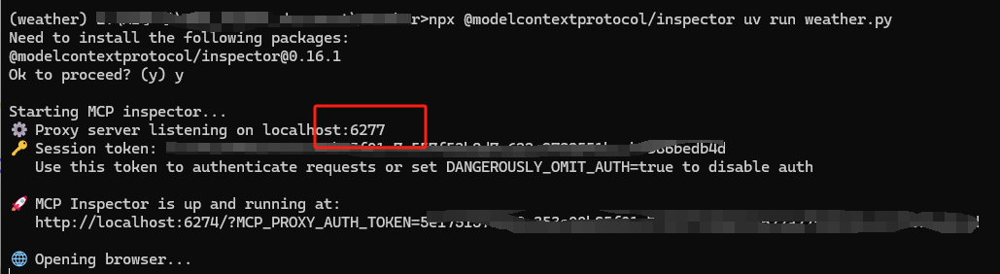

### 7.1.3 Inspector的功能概述

通过浏览器可以访问 localhost:6274 ，单击左侧Server面板的Connect按钮，连接到服务器传输层（在command当中修改为`uv`，在Arguments当中填写`run weather.py`）， 如图7-2所示。

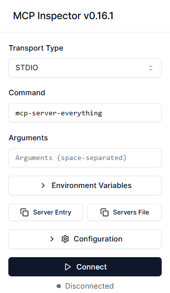

连接成功以后，界面的右侧的工具面板会显示Resources、Prompts、Tools、Ping、Sampling和Roots等选项卡，如图7-3所示。

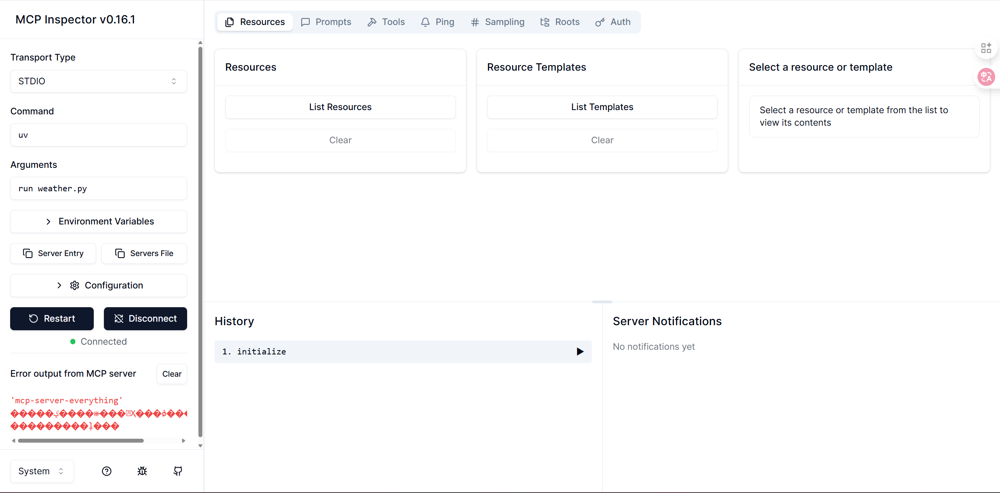

**1. Resources选项卡**

Resources选项卡指向LLM展示数据和内容。其主要功能包括列出所有可用的Resource、展示Resource的元数据（如类型和描述）、提供Resource内容的检查功能以及支持订阅测试，如图7-4所示。

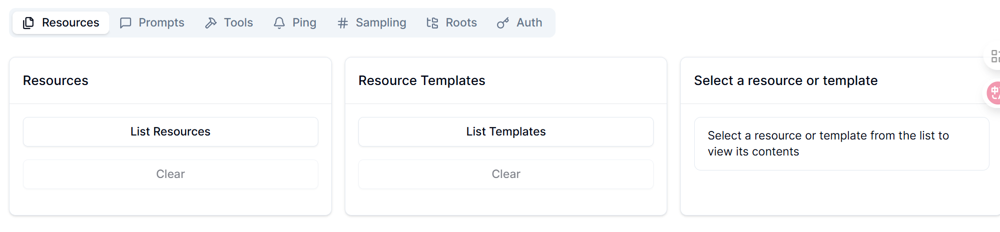

**2. Prompts选项卡**

Prompts选项卡支持创建可复用单独提示模板以及工作流。其主要功能包括展示可用Prompt模板、显示Prompt参数与描述、启动自定义参数的Prompt测试、预览生成的信息，如图7-5所示。


**3. Tools选项卡**

Tools选项卡允许LLM通过MCP Server执行相关的操作。该选项卡主要功能包括列出可用的Tool、展示Tool模式和描述、启动自定义的Tool测试、显示Tools的执行结果，如图7-6所示。


**4. Ping选项卡**

Ping选项卡用户检测MCP Server的连通性。可以通过单机Ping Server按钮进行测试，如图7-7所示。

**5. Sampling选项卡**

Sampling选项卡允许用户查看MCP Server向LLM发送补全请求的结果。在该选项卡下，可以查看请求的记录情况，如图7-8所示。


**6. Roots选项卡**

Roots选项卡用于设定MCP Server的操作范围。在Roots选项卡下，用户可以添加本地的文件路径，以指导MCP Server的具体操作，如图7-9所示。


### 7.1.4 调试

本例用于查询天气和MCP Server属于Tools。具体调试过程如下，进入Tools选项卡，单机List Tools按钮，可以看到下方列出了query_weather工具，单击此工具，在右侧界面的city框内输入`Wuhan`，Tool Result处即会显示Success，其下方还显示武汉的天气状况信息，如图7-10所示。

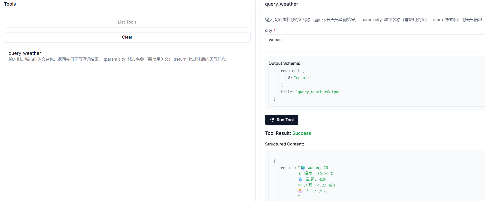

## 7.2 MCP Server的高级开发

完成基于STDIO传输协议的天气查询MCP Server的开发实践后，本节将进一步探讨MCP Server的高级开发---使用SSE技术进行开发。同时，还将介绍MCP Server的上线发布，以确保服务的稳定性和可用性。

### 7.2.1 基于SSE的MCP Server开发

为了提高开发效率，我们可以基于上一章开发的MCP项目进行迭代。在此之前，我们需要备份已有的MCP文件夹，然后在保留原有功能的基础上进行修改。具体步骤如下:

**1. 创建文件**

删除主目录下的`client.py`和`main.py`文件，创建`src`文件夹，将`weather.py`文件移入src目录，并在src目录下创建`__main__.py`和`__init__.py`文件。

**2. 代码编写**

先将weather.py文件当中的最后一行`mcp.run(transport="stdio")`修改为`mcp.run(transport="sse")`。然后，在`__main__.py`文件内容添加如下代码：

```python
from weather import main

main()
```

**3. 测试运行**

在命令提示符窗口中，进入项目文件夹，激活虚拟环境后执行启动命令`uv run ./src/weather.py`运行MCP Server，MCP Server将运行在本地8000端口。

新开一个命令提示符窗口，进入项目文件夹并激活**虚拟环境**后，执行`npx -y @modelcontextprotocol/inspector uv run ./src/weather.py`运行调试工具。

在Inspector界面中Server面板选择`Transport Type`为`SSE`，在URL处输入 http://0.0.0.0:8000/sse 连接后在Inspector工具面板的Tools选项卡并单击`List Tools`按钮即可看到工具列表。测试运行返回结果后，SSE通信的MCP Server开发完成，如图7-11和图7-12所示。

> 注：大家在命令行窗口当中运行uv run ./src/weather.py时，打开网页出现404则尝试在网页链接当中后续添加\sse，查看是否返回200ok

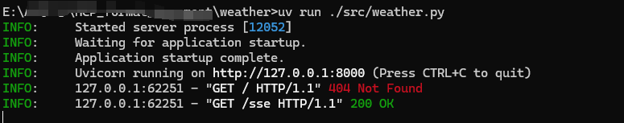

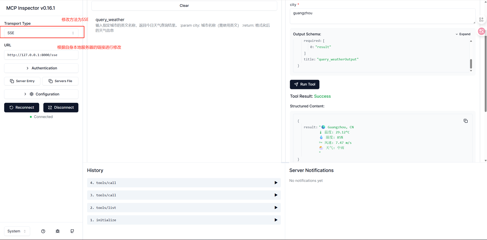

### 7.2.2 MCP Server的上线发布

在完成MCP Server的开发和调试后，我们需要将其上线发布，以确保服务的稳定性和可用性。本节将介绍如何将MCP Server部署到服务器上，并确保其能够正常运行。SSE模式的MCP Server测试成功之后，我们便可以将其上传并发布到**PyPI(Python Package Index)**上，其作为python官方的第三方包软件存储库，作为python生态系统的重要组成部分，它担任着集中存储和分发Python包的关键角色。 接下来时线下发布的具体步骤

**1. 获取API token**

在PyPI官网注册账号（这部分可以上网查一下），在Account Settings当中创建并获取API token，如图7-13所示。

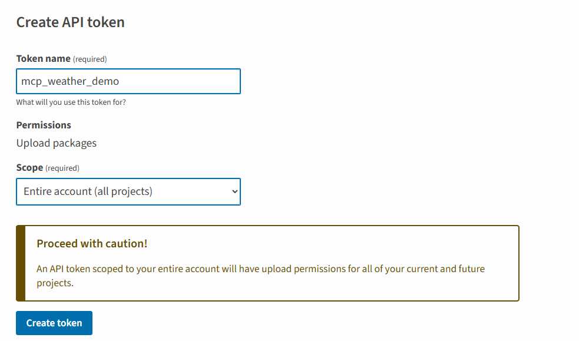

**2. 配置项目配置文件**

修改根目录的项目配置文件`pyproject.toml`(此文件用于声明依赖的包和版本，在实际操作当中请修改`name`以及[project.scripts]内的字段，以免因包名冲突而无法成功上传），增加以下代码：

```toml
[build-system]
requires=["setuptools>=61.0","wheel"]
build-backend = "setuptools.build_meta"
[project]
name = "search-for-weather" #这里大家自行修改
version = "0.1.0"
description = "Add your description here"
readme = "README.md"
requires-python = ">=3.10"
dependencies = [
    "httpx>=0.28.1",
    "mcp>=1.12.0",
    "openai>=1.97.0",
    "python-dotenv>=1.1.1"
]
[project.scripts]
search-for-weather= "weather:main"

[tool.setuptools]
package-dir = {""="src"}

[tool.setuptools.packages.find]
where = ["src"] 
```

**3. 打包上线**

将准备好的文件打包，并将其发布到PyPI平台。

- 安装工具包。通过命令提示符窗口进入项目文件夹，并激活虚拟环境，安装`build`工具包和`twine`工具包。其中，`build`
  工具包用于Python的构建，`twine`工具包用于发布Python包到PyPI平台，命令如下:

```cmd
uv pip install build twine
```

- 打包项目并上传。在命令提示符窗口执行命令`python -m build`打包项目。完成后执行命令`python -m twine upload dist/*`，将项目上传到PyPI平台。根据提示输入PyPI平台上的APItoken后即可完成上传，如图7-14和图7-15所示。
- 上传完成之后，任意计算机可以通过`pip install my-weather-demo`（这里我写的是`pip install search-for weather`，大家如果没办法上传完成，可以看看是否是在dist文件夹当中没有删除my-weather-demo的压缩包）命令安装该项目。

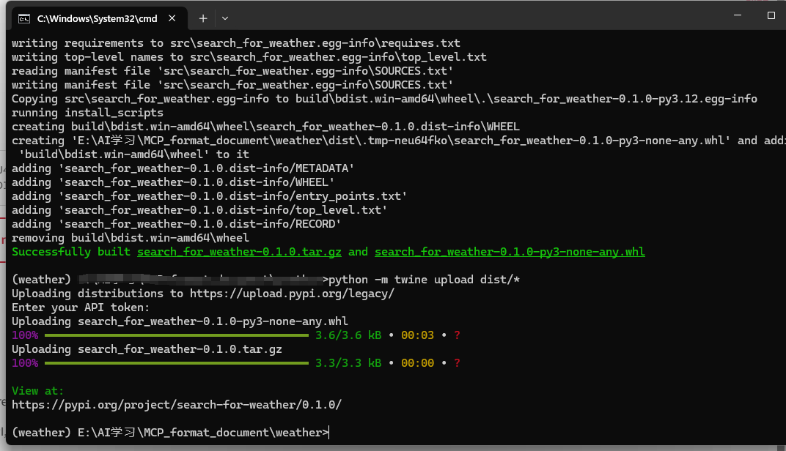

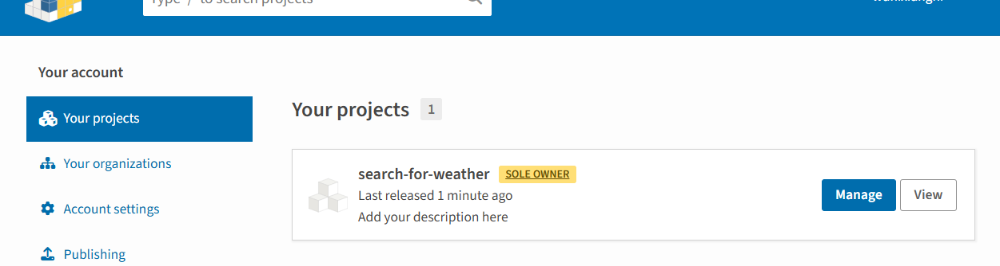

## 7.3 MCP 共享记忆--基于OpenMemory

各位读者是否经常遭遇"对话终止即失忆"的困境?目前主流的AI助手以及开发工具普遍存在信息孤岛现象--会话一旦结束，上下文记忆便瞬间清零，着极大地限制了工作效率的提升，导致用户体验不佳。

针对以上问题，突破性的开源解决方案OpenMemory应运而生。OpenMemory专门针对AI工具的"记忆难题"而设计，旨在实现跨平台上下文信息的只能共享和无缝链接。

### 7.3.1 项目介绍

OpenMemory的核心价值在于构建AI协作生态：用户可基于统一记忆中枢，先在Claude完成智能路径规划，随机无缝链接到Cursor执行具体操作，利用两大工具通过MCP实现上下文信息的智能基础和数据流传。这种跨平台记忆延续机制，彻底打破了传统AI工具之间的信息壁垒，使工作流程真正实现智能化贯通。

OpenMemory项目地址：https://github.com/mem0ai/mem0/tree/main/openmemory

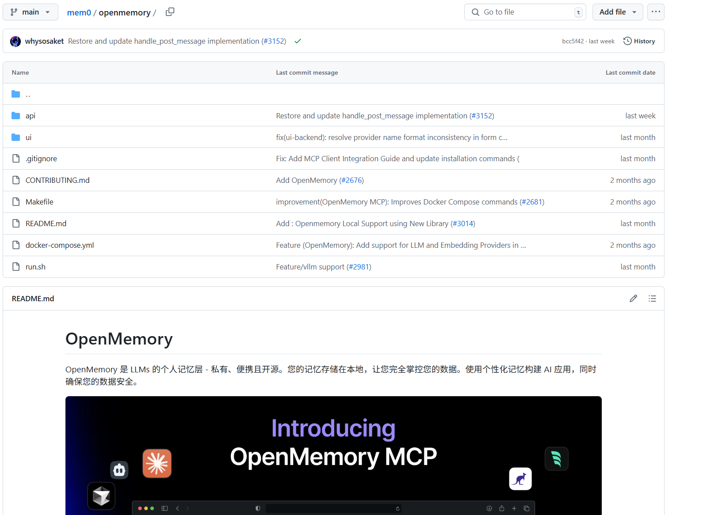

### 7.3.2 部署设置

OpenMemory的部署设置主要步骤如下:

**1. 项目部署**

从GitHub上复制OpenMemory的MCP源代码至本地计算机当中，然后在命令提示符窗口执行以下命令，快速构建项目:

```cmd
make build
make up
make ui
```

执行以上命令之后，将在 http://localhost:8765 上启动`OpenMemory MCP Server`，可通过访问 http://localhost:8765/docs 查看API文档，同时`OpenMemory`的用户界面将在 http://localhost:3000 上运行。

**2. 项目测试**

在OpenMemory的用户界面当中，我们可以安装到Claude、Cursor、Cline等各个客户端上。

各个安装命令如图7-17，图7-18所示

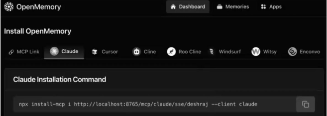

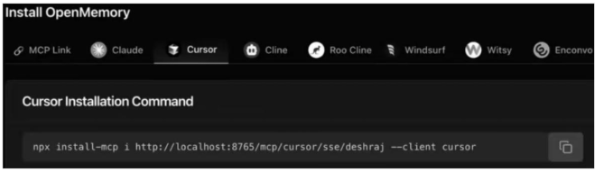

**3. OpenMemory MCP测试**

打开Claude的客户端，输入以下的文字，让Claude上记住作者Memo0的相关信息。可以看到，Claude成功存入记忆如图7-19所示。

> I'm Deshraj Yadav， Co-founder and CTO at Mem0( f.k.a Embedchain ). I am broadlyinterestedin the field of Artificial
> Intelligence and Machine Learning Infrastructure.Previously， I was SeniorAutopilot Engineer at Tesla Autopilot where I
> led the Autopilot's Al Platform which helped theTesla Autopilot team to track large scale training and modelevaluation
> experiments， providemonitoring and observability into jobs and training cluster issues.


回到OpenMemory的用户界面，可以看到 OpenMemory 已经获取了之前通过 Claude 保存的所有信息，如图7-20所示。

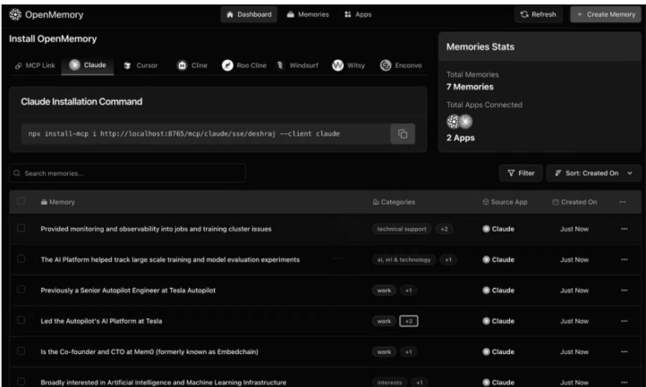

在Cursor的用户界面，输入`Fetch everything you know about me from memories`，查询关于“我”的信息，可以看到，Cursor调用了OpenMemory MCP的list_memories工具，并成功返回了结果，如图7-21所示。


访问OpenMemory的用户界面的控制面板，进入Apps页面，可以看到，Claude创建的记忆，Cursor访问了多少条记忆，如图7-22所示。


